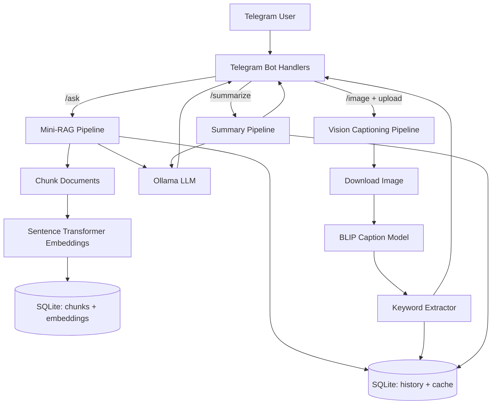

# Hybrid GenAI Telegram Bot

A complete **Python Telegram bot** that satisfies the assignment by supporting both required tracks:

- **Mini-RAG** for `/ask <query>`
- **Vision captioning** for `/image` + uploaded image
- **/help** usage instructions
- **/summarize** optional enhancement
- **Last 3 interactions per user** memory
- **SQLite-based caching + storage**
- **Source snippets** shown in RAG replies

This project was intentionally built as a **hybrid bot** so it covers the assignment fully and goes slightly beyond the minimum.

---

## 1) Features

### Required
- Telegram bot interface using `python-telegram-bot`
- `/ask <query>` command for RAG questions
- `/image` command for image uploads and description
- `/help` command for usage instructions
- Local document knowledge base with chunking + embedding + retrieval
- Local image captioning using an open-source vision model
- Replies back to the user with a generated answer or caption

### Optional enhancements included
- Per-user **history awareness** (last 3 interactions stored in SQLite)
- **Query caching** for repeated `/ask` questions
- **Source snippets** displayed with RAG output
- `/summarize` command to summarize the last image/chat response

---

## 2) Tech Stack

### Bot
- `python-telegram-bot`

### RAG
- **Embedding model:** `sentence-transformers/all-MiniLM-L6-v2`
- **Vector store:** local **SQLite** database (embeddings stored locally)
- **LLM for answer generation:** **Ollama** (default: `llama3.2:3b`)
  - If Ollama is unavailable, the bot falls back to a simple extractive answer.

### Vision
- **Captioning model:** `Salesforce/blip-image-captioning-base`
- **Tag generation:** lightweight keyword extraction from the generated caption

### Storage
- SQLite for:
  - chunk storage
  - embedding storage
  - query cache
  - interaction history

---

## 3) Project Structure

```text
genai_telegram_bot/
├── app.py
├── README.md
├── requirements.txt
├── .env.example
├── Dockerfile
├── docker-compose.yml
├── data/
│   ├── bot.db                # created at runtime
│   ├── docs/                 # local RAG knowledge base
│   └── images/               # downloaded Telegram images
├── demo/
│   ├── demo_transcript.md
│   ├── mock_screenshot_1.png
│   ├── mock_screenshot_2.png
│   └── mock_screenshot_3.png
├── src/
│   └── bot/
│       ├── __init__.py
│       ├── bot_app.py
│       ├── config.py
│       ├── database.py
│       ├── llm.py
│       ├── rag.py
│       ├── utils.py
│       └── vision.py
└── tests/
    └── test_chunking.py
```

---

## 4) How it Works

### A. `/ask <query>` flow
1. User sends `/ask How do I reset MFA?`
2. Bot embeds the query with `all-MiniLM-L6-v2`
3. Bot compares query embedding with chunk embeddings stored in SQLite
4. Top-k chunks are retrieved
5. Prompt = retrieved context + recent interaction history
6. Ollama generates a concise answer
7. Bot replies with:
   - answer
   - source snippets used
   - cache note if the answer came from cache

### B. `/image` flow
1. User sends `/image`
2. User uploads a photo
3. Bot downloads the image locally
4. BLIP generates a caption
5. Bot extracts 3 keywords/tags from the caption
6. Bot replies with caption + tags

### C. `/summarize` flow
1. Bot fetches the last interaction from SQLite
2. If Ollama is available, it summarizes the output
3. Otherwise, it returns a concise fallback summary

---

## 5) System Design Diagram



---

## 6) Local Setup

### Prerequisites
- Python 3.11+
- Telegram bot token from BotFather
- Optional but recommended: **Ollama** installed locally

### Install
```bash
python -m venv .venv
source .venv/bin/activate
pip install -r requirements.txt
cp .env.example .env
```

### Update `.env`
```env
TELEGRAM_BOT_TOKEN=<your_telegram_bot_token>
BOT_MODE=hybrid
DB_PATH=data/bot.db
DOCS_PATH=data/docs
IMAGE_CACHE_DIR=data/images
EMBEDDING_MODEL=sentence-transformers/all-MiniLM-L6-v2
VISION_MODEL=Salesforce/blip-image-captioning-base
LLM_PROVIDER=ollama
LLM_MODEL=llama3.2:3b
OLLAMA_BASE_URL=http://localhost:11434
TOP_K=3
CHUNK_SIZE=500
CHUNK_OVERLAP=80
MAX_HISTORY=3
```

### Start Ollama (recommended)
```bash
ollama serve
ollama pull llama3.2:3b
```

### Run the bot
```bash
python app.py
```

---

## 7) Docker Compose Option

```bash
cp .env.example .env
# edit TELEGRAM_BOT_TOKEN in .env

docker compose up --build
```

If you use the bundled Ollama service, pull the model in the Ollama container once:

```bash
docker exec -it <ollama_container_name> ollama pull llama3.2:3b
```

---

## 8) Commands

### `/help`
Shows usage instructions.

### `/ask <query>`
Example:
```text
/ask How do I reset MFA?
```

Example response:
```text
Go to the identity portal and choose "Reset verification method." If you cannot access the portal, contact the IT helpdesk and request a temporary bypass code...

Source snippets used:
• it_support_faq.md (chunk 0, score=0.8123)
• employee_handbook.md (chunk 0, score=0.6891)
```

### `/image`
Usage:
1. Send `/image`
2. Upload a photo
3. Receive caption + tags

Example response:
```text
Caption: a laptop on a desk beside a notebook
Tags: laptop, desk, notebook
```

### `/summarize`
Summarizes the bot's most recent response.

---

## 9) Knowledge Base Documents

The repository includes 5 sample local documents:
- `employee_handbook.md`
- `it_support_faq.md`
- `product_faq.md`
- `recipes.md`
- `oncall_runbook.md`

You can replace them with any 3-5 domain documents required by your use case.

---

## 10) Design Choices and Reasoning

### Why Telegram?
- Fastest route to a simple chat interface
- Clean command-based UX
- Easy file/image upload support

### Why a hybrid bot?
- Covers both core assignment tracks in one submission
- Demonstrates multi-modal capability
- Stronger evaluation signal for innovation and design

### Why SQLite?
- Lightweight
- Zero infrastructure overhead
- Suitable for a small local RAG assignment

### Why `all-MiniLM-L6-v2`?
- Small, popular, accurate enough for small RAG systems
- Easy local inference

### Why BLIP for images?
- Open-source
- Straightforward local captioning
- Good fit for assignment-scale vision tasks

### Why Ollama?
- Local inference friendly
- Clean API from Python
- Swappable model backend

---

## 11) Evaluation Criteria Mapping

### Code Quality
- Modular files by responsibility
- Config-driven design
- Minimal, readable Python structure

### System Design
- Separate RAG, vision, storage, and bot layers
- Clear data flow from message -> processing -> reply

### Model Use
- Local embedding model
- Local captioning model
- Local LLM through Ollama

### Efficiency
- SQLite query cache
- Stored chunk embeddings
- Lightweight top-k retrieval

### User Experience
- Clear command UX
- Helpful fallback messages
- Source visibility for trust

### Innovation
- Hybrid multi-modal bot
- Summary command
- Short-term conversational memory

---

## 12) Notes / Limitations

- For large knowledge bases, a dedicated vector DB would scale better than manual SQLite similarity search.
- BLIP captioning is lightweight but not as strong as newer larger multimodal models.
- First-time model downloads may take time.
- Ollama is optional; fallback answering still works, but responses become more extractive.

---

## 13) Demo Assets

See the `demo/` folder for:
- example interaction transcript
- 3 illustrative mock screenshots

---

## 14) Quick Submission Checklist

- [x] Source code in Python
- [x] README with local run instructions
- [x] Models/APIs documented
- [x] System design diagram included
- [x] Demo transcript included
- [x] Demo screenshots included
- [x] `/ask` command
- [x] `/image` command
- [x] `/help` command
- [x] Optional `/summarize` command
- [x] Message history awareness
- [x] Caching
- [x] Source snippets

